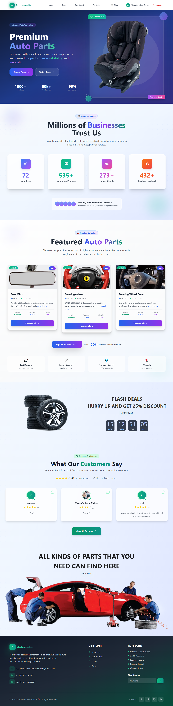
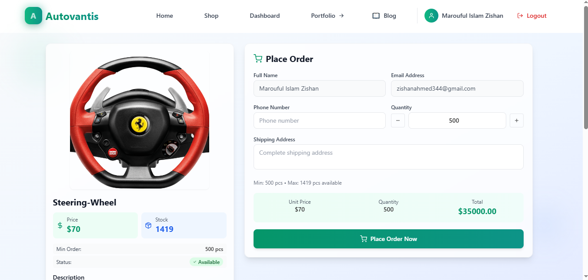
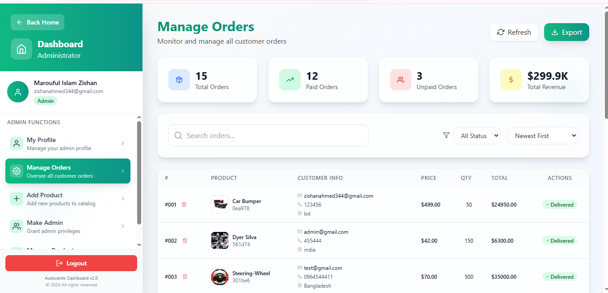
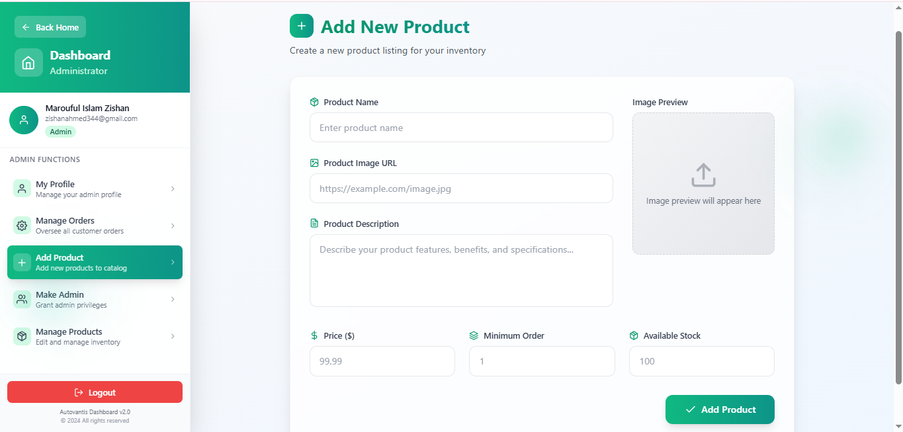
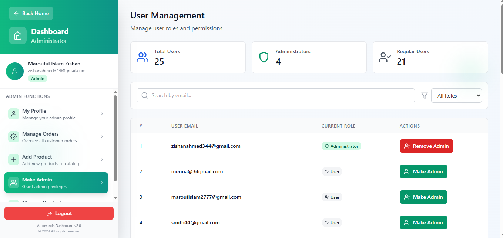
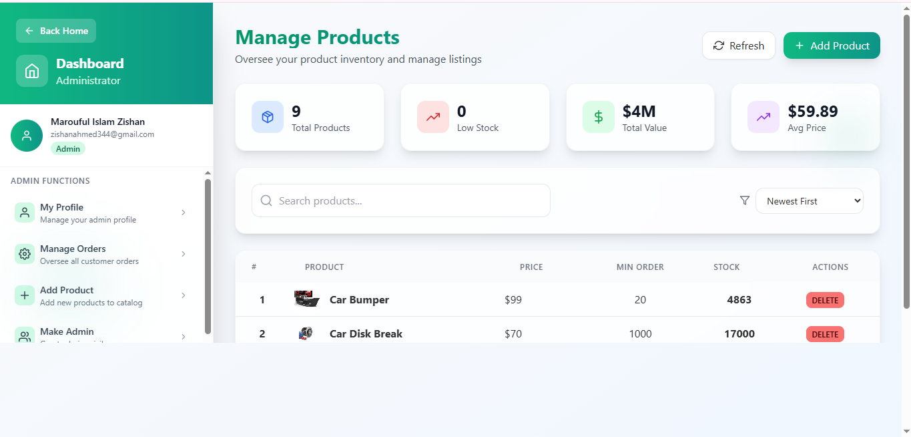
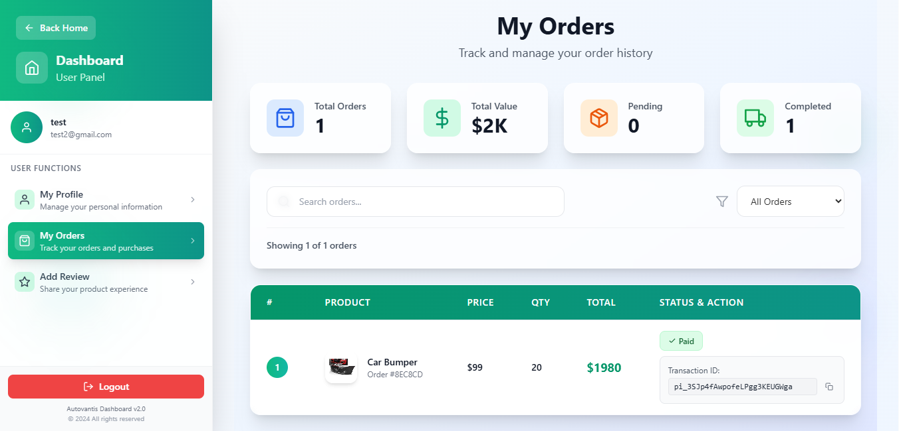
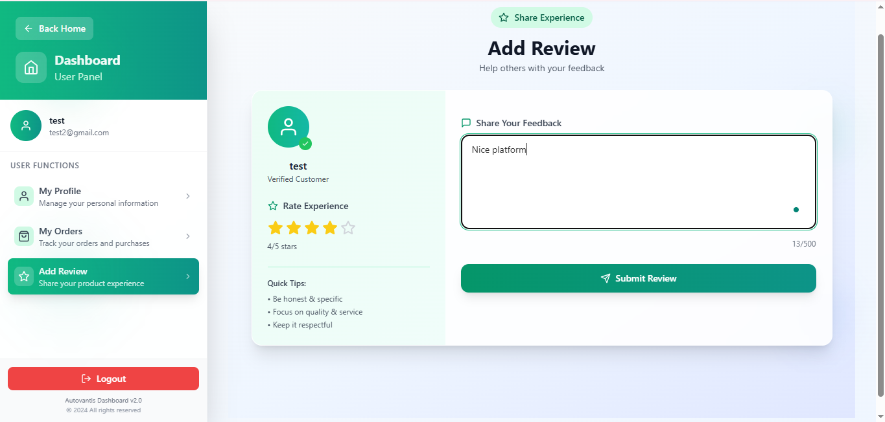

# 🚗 Autovantis: Car Parts Manufacturer Website

A smart, stylish, and feature-rich web application for car parts manufacturers and buyers. Built with modern technologies for a seamless experience.

---

## 🌐 Live Demo
- [Autovantis Website](https://car-parts-b9011.web.app/)
- [Server GitHub Repo](https://github.com/zishan344/manufacturer-website-server-side)

## ✨ Features
- Modern, responsive UI
- Secure authentication (Firebase)
- User & Admin dashboards
- Product management (add, edit, delete)
- Order management
- Stripe payment integration
- Review & rating system
- Profile management
- Blog & portfolio sections

## 🛠️ Tech Stack
**Frontend:**
- React
- React Router
- Tailwind CSS
- Firebase
- React Query
- React Hook Form
- Stripe
- React Toastify
- React Icons

**Backend:**
- Node.js
- Express.js
- MongoDB
- dotenv
- cors

## 📁 Main Sections
- Home
- Dashboard (User & Admin)
- Add/Manage Products
- Orders & Payments
- Reviews
- Profile
- Blogs
- Portfolio

## 🖼️ Screenshot

#

#

#

#

#

#

#

#


## 📋 How to Run Locally
1. Clone the repo:
   ```bash
   git clone https://github.com/zishan344/manufacturer-website-client-side.git
   ```
2. Install dependencies:
   ```bash
   npm install
   ```
3. Start the app:
   ```bash
   npm start
   ```

## 📖 Description
Autovantis is a car parts manufacturer website where users can browse, buy, and review products. Admins can manage inventory, orders, and users. The platform is designed for speed, security, and ease of use.

## 📝 License
MIT
